# Module 6 - Artifact Repository Manager with Nexus

## Project: Run Nexus on Droplet and Publish Artifact to Nexus

This project guides you through the process of setting up an artifact repository. You will learn how to install, secure, and configure **Sonatype Nexus Repository Manager** on a cloud server following best practices.

### Technologies Used

* **Nexus Repository Manager**
* **DigitalOcean** (Cloud Infrastructure)
* **Linux** (Ubuntu Server)
* **Java** (OpenJDK 17)
* **Gradle** (Gradle 9.2.1)
* **Maven** (Apache Maven 3.9.12)

### Project Description

* Install and configure Nexus from scratch on a cloud server
* Create a new user on Nexus with relevant permissions
* Java Gradle Project: Build a Jar and upload it to Nexus
* Java Maven Project: Build a Jar and upload it to Nexus

### Prerequisites

* A DigitalOcean Droplet (Ubuntu 22.04 or 24.04 recommended). [Create a Droplet](https://github.com/ana-os-mo/digital-ocean-server/blob/main/README.md#step-1-create-a-digitalocean-droplet) and [Configure the Firewall](https://github.com/ana-os-mo/digital-ocean-server/blob/main/README.md#step-2-configure-the-initial-firewall)
* SSH access via a non-root user with `sudo` privileges. [Configure the User](https://github.com/ana-os-mo/digital-ocean-server/blob/main/README.md#step-3-connect-and-configure-a-secure-admin-user)

**Droplet's Recommended Plan:** Nexus is a resource-intensive Java application. To avoid performance issues, use the following specifications:

* 8 GB RAM / 4 vCPUs
* 160 GB SSD
* 5 TB Transfer

---

Nexus Artifact Repository is a tool used to store, manage, and share build artifacts like libraries, packages, and container images. Teams publish and retrieve them from Nexus. It also helps control versions, enforce policies, and maintain a single trusted source of artifacts across development, CI/CD pipelines, and production.

<details>
<summary><strong>Step 1: Install Java and Download Nexus</strong></summary>

From your local terminal, access the server with your admin user via SSH to begin with the installation.

1. **Install Java on the server:** Install `OpenJDK 17` (required for Nexus 3.72.0-04) if not installed yet. Use `java -version` to verify the installation.

    ```bash
    sudo apt update
    sudo apt install openjdk-17-jre-headless -y
    ```

2. **Download Nexus:** Navigate to the `/opt` directory and download Nexus `3.72.0-04`.

    ```bash
    cd /opt
    sudo wget https://download.sonatype.com/nexus/3/nexus-3.72.0-04-unix.tar.gz
    ```

3. **Unzip**: Extract the archive to generate the two core directories.

    ```bash
    sudo tar -zxvf nexus-3.72.0-04-unix.tar.gz
    ```

    * **Nexus Folder (`/opt/nexus-3.72.0-04`):** The **Installation Directory**. It contains the application binaries and runtime code. This should remain read-only for the service user to prevent unauthorized modifications to the software.
    * **Sonatype Folder (`/opt/sonatype-work`):** The **Data Directory**. This contains your repositories, blob stores, databases, and logs. This directory must be writable by the Nexus user and is the most important folder to include in your backup strategy.

> **Using Other Versions:**
> While this guide uses version `3.72.0-04`, you can find alternative releases on the [Sonatype Download Archives](https://help.sonatype.com/en/download-archives---repository-manager-3.html). However, you must verify the [Nexus System Requirements](https://help.sonatype.com/en/sonatype-nexus-repository-system-requirements.html) as newer versions (3.87+) typically require **Java 21**, while older versions may require **Java 8 or 11** and may have different hardware needs.

</details>

---

<details>
<summary><strong>Step 2: Create a Dedicated Service Account to Run Nexus</strong></summary>

Running Nexus as `root` is a significant security risk. We will create a dedicated system user and apply the **Principle of Least Privilege**. You can do it yourself or use the provided script.

**What the script does:**

* **Creates a System User**: Sets up a restricted `nexus` user with a valid shell but no password login.
* **Initializes Profile Workspace**: Creates `/var/lib/nexus` as a clean home directory for Java preferences.
* **Version Management**: Creates a symbolic link at `/opt/nexus` for easier future upgrades.
* **Sets Strict Permissions**: Grants the `nexus` user ownership of the data and profile folders while keeping binaries owned by `root`.

***Execution***

1. **Transfer the script**: From your **local machine**, copy the `setup-nexus-env.sh` script to your admin user's home directory in the server.

    ```bash
    # Secure copy
    scp ./scripts/setup_nexus_env.sh admin@{droplet-ip}:/home/admin/
    ```

2. **Run the script:** On the **server**, navigate to your home directory and run the script with the version as a parameter.

    ```bash
    # Make the script executable
    sudo chmod +x setup_nexus_env.sh

    # Run the script
    sudo ./setup_nexus_env.sh "3.72.0-04"
    ```

</details>

---

<details>
<summary><strong>Step 3: Run Nexus</strong></summary>

You can run Nexus manually or configure it as a system service. Using **Systemd** is highly recommended for production to ensure the application restarts on failure and correctly manages file handle limits.

### Option A: Manual Execution (For Testing)

If you wish to run the application manually:

```bash
# Switch to nexus user
sudo su - nexus

# Start the service
/opt/nexus/bin/nexus start
```

**Note:** To stop it manually, use `/opt/nexus/bin/nexus stop`.

### Option B: Systemd Service (Recommended)

With your admin user:

1. **Create the service file:**

    ```bash
    sudo vim /etc/systemd/system/nexus.service
    ```

2. **Paste the following configuration:** You can see the explanation for each line in the `scripts/system-service.ini` file provided in this project.

    ```ini
    [Unit]
    Description=Nexus Repository Service
    After=network.target

    [Service]
    Type=forking
    LimitNOFILE=65536
    ExecStart=/opt/nexus/bin/nexus start
    ExecStop=/opt/nexus/bin/nexus stop
    User=nexus
    WorkingDirectory=/var/lib/nexus
    Restart=on-abort
    TimeoutSec=600

    [Install]
    WantedBy=multi-user.target
    ```

3. **Start and Enable**: Activate the service with the following commands

    ```bash
    sudo systemctl daemon-reload
    sudo systemctl enable nexus
    sudo systemctl start nexus
    ```

4. **Check the Service Status:**

    ```bash
    sudo systemctl status nexus
    ```

    * **Note:** Nexus takes 1-2 minutes to fully boot up. You can monitor the progress by following the logs:

    ```bash
    sudo tail -f /opt/sonatype-work/nexus3/log/nexus.log
    ```

    Wait until you see the message: `Started Sonatype Nexus OSS 3.72.0-04`.

</details>

---

<details>
<summary><strong>Step 4: Update Firewall and Initial Login</strong></summary>

Verify the application is running on port `8081` (Nexus default).

```bash
# Get the process
ps aux | grep nexus

# Get the port knowing the process (:::8081)
netstat -lnpt
```

1. **Configure DigitalOcean Firewall**:

    Go to **DigitalOcean Dashboard > Networking > Firewalls**. Edit your firewall and add a new **Inbound Rule**:

    | Type | Protocol | Port Range | Sources | Purpose |
    | --- | --- | --- | --- | --- |
    | **Custom** | TCP | 8081 | `All IPv4` `All IPv6` | Allows the public to access your app. |

2. **Verify Access**: Open your browser and navigate to `http://{droplet-ip}:8081`.

3. **Initial Admin Password**: To log in for the first time as the Nexus `admin` user, you need to retrieve the auto-generated temporary password:

    ```bash
    sudo cat /opt/sonatype-work/nexus3/admin.password
    ```

    **Credentials:**
      * **Username:** `admin`
      * **Password:** (from the command above)

    Then:
      1. Navigate to `http://{droplet-ip}:8081` and click **Sign in**
      2. Enter the credentials
      3. You will be prompted to create a new permanent password for the admin user
      4. Enable anonymous access

</details>

---

<details>
<summary><strong>Step 5: Create a User in Nexus</strong></summary>

We will use the default `maven-snapshots` hosted repository in Nexus.

For security best practices, we should not share admin credentials. Instead, create a dedicated user with limited permissions to upload and download artifacts from the repository.

**Prerequisites:** You must be logged in as the admin user.

1. **Create a Role:** Roles define which repositories and operations a user can access. Create a role with appropriate permissions for uploading artifacts.

    * Navigate to **Settings (Gear Icon) > Security > Roles**.
    * Click **Create Role** and select **Nexus role** as the type.
    * Assign a `Role ID` and a `Role Name`.
    * Click **Modify Applied Privileges** and search for `nx-repository-view-maven2-maven-snapshots-*` (this gives full access to the snapshots repo).
    * Click **Save** at the bottom of the page.

    <p align="center">
      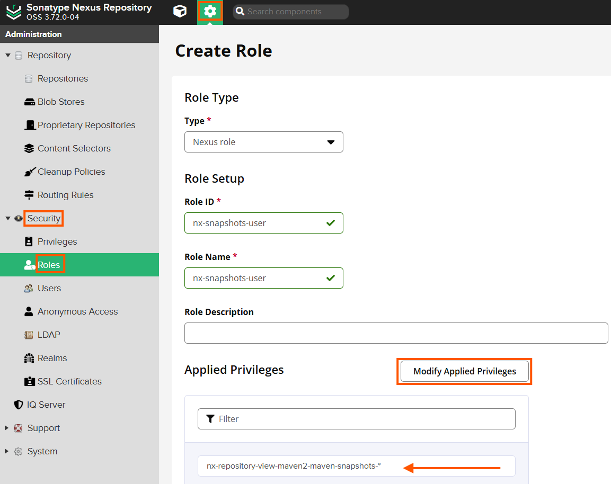
    </p>

2. **Create a Nexus User:** Create a new user and assign it the role you created above to access the snapshots repository.

    * Go to **Settings > Security > Users**.
    * Click **Create local user**.
    * Fill the required fields and add the role.
    * Click **Create local user**.

    <p align="center">
      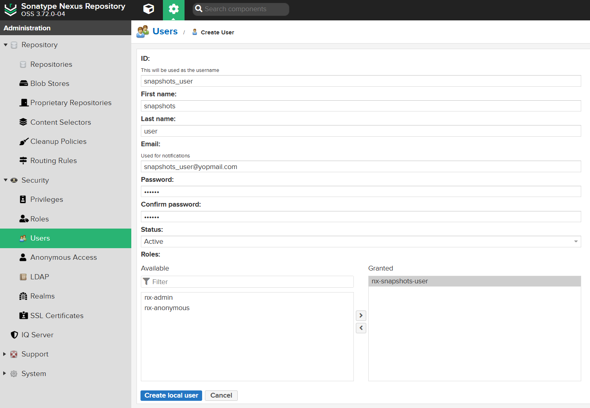
    </p>

</details>

---

<details>
<summary><strong>Step 6: Upload JAR File to Nexus</strong></summary>

Now we will configure our Java projects to talk to Nexus. We will look at two different build tools: **Gradle** and **Maven**.

### Gradle Project

Use your terminal to open the `java-gradle-app` project in your local machine.

1. **Configure `build.gradle`:**

    We need to add the `maven-publish` plugin. This plugin adds the necessary tasks to the Gradle build (like `publish`) to generate the POM file and upload the artifacts.

    ```groovy
    plugins {
      ...
      id 'maven-publish' // Required to publish artifacts to a remote repo
      ...
    }

    ...

    group = 'com.example'
    version = '1.0-SNAPSHOT'

    publishing {
      // Define WHAT to publish
      publications {
        create('maven', MavenPublication) {
          artifact tasks.named('bootJar')
        }
      }

      // Define WHERE to publish
      repositories {
        maven {
          name = 'nexus'
          // The URL to your specific repository on the server
          url = uri("http://{your_nexus_ip}:{your-nexus-port}/path-to/your-repository/")
          // Since we haven't set up SSL (HTTPS), Gradle will block
          // the connection by default for security. We must explicitly allow HTTP.
          allowInsecureProtocol = true
          credentials {
            username = project.findProperty('nexusUsername')
            password = project.findProperty('nexusPassword')
          }
        }
      }
    }

    ...
    ```

    You can get the Nexus URL from the repository.

    <p align="center">
      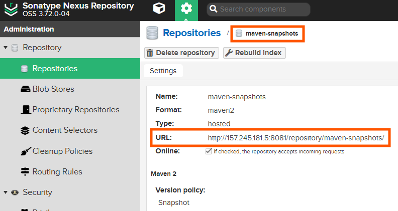
    </p>

2. **Configure Credentials:**

    You should **never** hardcode passwords inside `build.gradle`, as that file is committed to Git. Instead, we use `gradle.properties` and exclude it from version control, or use environment variables.

    Create or edit `gradle.properties` in the project root and use the credentials for the user we created in Step 5.

    ```properties
    nexusUsername = replace_with_your_nexus_username
    nexusPassword = replace_with_your_nexus_password
    ```

3. **Build and Publish:**

    Run the following commands in your terminal:

    ```bash
    # 1. Compile the code and package the JAR
    gradle build

    # 2. Upload the JAR and generated POM to Nexus
    gradle publish
    ```

4. **Verify:**

    Go to Nexus **Browse server contents > Browse** and open the `maven-snapshots` reposiry. You should see your artifact structure created automatically.

    <p align="center">
      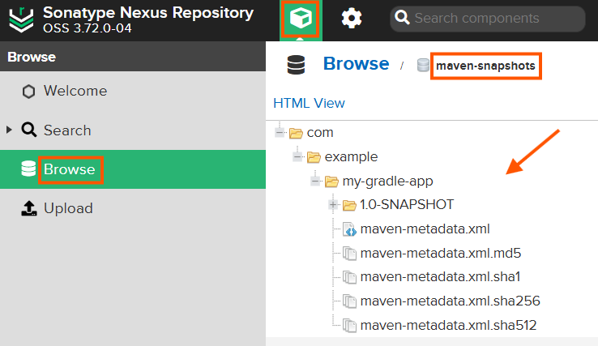
    </p>

### Maven Project

Use your terminal to open the `java-maven-app` project in your local machine.

Maven handles publication differently. It separates **Project Information** (stored in `pom.xml`) from **User Credentials** (stored in `settings.xml`).

1. **Configure `pom.xml`**

    In this file we should define what we are building, add the `maven-deploy-plugin` to handle connection to Nexus, and tell Maven where the Nexus server is located.

    ```xml
    <project ...>
        ...
        <groupId>com.example</groupId>
        <artifactId>my-maven-app</artifactId>
        <version>1.0-SNAPSHOT</version>

        <build>
            <plugins>
                <plugin>
                    <groupId>org.apache.maven.plugins</groupId>
                    <artifactId>maven-deploy-plugin</artifactId>
                    <version>3.1.4</version>
                </plugin>
                ...
            </plugins>
        </build>

        <distributionManagement>
            <snapshotRepository>
                <id>nexus-snapshots</id>
                <url>http://{your_nexus_ip}:{your-nexus-port}/path-to/your-repository</url>
            </snapshotRepository>
        </distributionManagement>
        ...
    </project>
    ```

2. **Configure Credentials:**

    Maven looks for credentials in your local home directory (`~/.m2/settings.xml`). This file is global for your user. The `.m2` directory is typically created automatically the first time a Maven build command is executed.

    ```bash
    vim ~/.m2/settings.xml
    ```

    Add the `<server>` configuration to the file. **Important:** The `<id>` here must match the `<id>` you put in the `pom.xml` exactly.

    ```xml
    <settings>
      <servers>
        <server>
          <id>nexus-snapshots</id>
          <username>replace_with_your_nexus_username</username>
          <password>replace_with_your_nexus_password</password>
        </server>
      </servers>
    </settings>
    ```

3. **Deploy:**

    In Maven, the `deploy` lifecycle phase handles the upload.

    ```bash
    # 'deploy' runs all previous steps (compile, test, package) and then uploads
    mvn deploy
    ```

    <p align="center">
      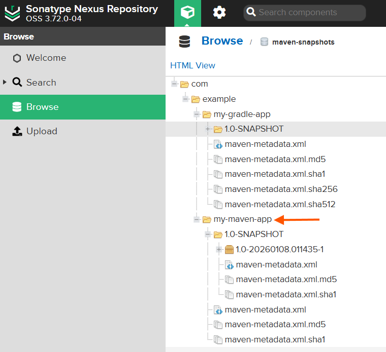
    </p>

</details>

---

<details>
<summary><strong>Step 7: Blob Stores</strong></summary>

In Nexus, a **Blob Store** is the actual physical storage layer where your binary files (the "blobs") are kept. While a **Repository** is a logical container that organizes your components (like Maven or npm), the **Blob Store** is the underlying engine that manages how those bits are written to a disk or a cloud bucket.

### Why is it useful?

Understanding Blob Stores is essential for scaling and maintaining your server:

* **Storage Separation:** You can separate different types of data into different physical disks. For example, you can put "Snapshots" (which grow very fast) on a large, cheap disk and "Releases" on a smaller, faster SSD.
* **Performance:** Spreading repositories across multiple blob stores can reduce I/O contention.
* **Cleanup & Maintenance:** You can run "Compact blob store" tasks on specific stores to reclaim space from deleted artifacts without affecting the entire system.

### The Default Blob Store

When you install Nexus (as seen in **Step 1**), a default blob store named `default` is created automatically.

* **Location:** By default, it is located at `/opt/sonatype-work/nexus3/blobs/default`.
* **Usage:** If you don't create a new one, every repository you create will share this single storage space.

### How to Create a New Blob Store

You might want to create a dedicated blob store for a specific team or project to keep their data isolated.

1. Log in as **admin**.
2. Go to **Settings > Repository > Blob Stores**.
3. Click **Create blob store**.
4. **Type:** Select `File` (standard for local disks) or `S3` (if you are using AWS).
5. **Name:** Give it a descriptive name (e.g., `gradle-snapshots-store`).
6. **Path:** If using `File`, it will automatically suggest a path within your data directory.
7. Click **Save**.

<p align="center">
  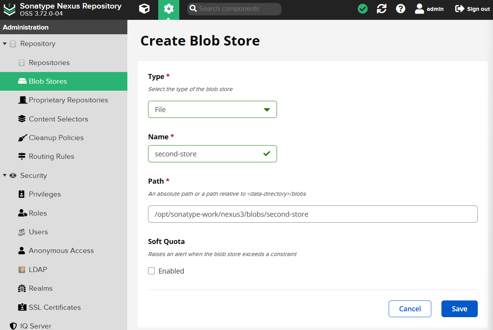
</p>

### Assigning a Repository to a Blob Store

**Important:** A repository is assigned to a blob store at the moment of creation. You cannot easily change a repository's blob store once it has been created.

1. Go to **Settings > Repository > Repositories**.
2. Click **Create repository** (or select a new one to configure).
3. In the configuration form, look for the **Storage** section.
4. **Blob store:** Select the store you created from the dropdown menu.
5. Click **Create repository**.

Now, every JAR or artifact you upload (using the steps in **Step 6**) to this specific repository will be physically stored in the dedicated location you defined.

</details>

---

<details>
<summary><strong>Step 8: Cleanup Policies and Scheduled Tasks</strong></summary>

Managing an artifact repository is not just about uploading files; it is also about preventing your storage from filling up.

A **Cleanup Policy** is a set of rules that defines which components are no longer needed. Instead of deleting files manually, you set criteria and Nexus identifies them for removal.

**Why use them?**

* **Storage Efficiency:** Automatically removes old, unused development builds.
* **Performance:** Keeps the repository index smaller and faster.
* **Cost Control:** Prevents cloud storage costs from growing indefinitely.

### 1. Create a Cleanup Policy

We will create a policy to keep only the most recent snapshots.

1. Log in as **admin**.
2. Go to **Settings > Repository > Cleanup Policies**.
3. Click **Create Cleanup Policy**.
    <p align="center">
      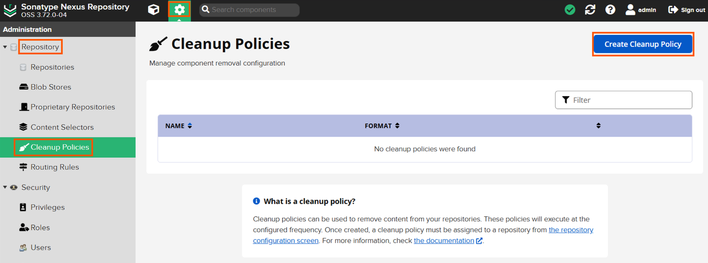
    </p>
4. Assign **Name** and **Format**.
    <p align="center">
      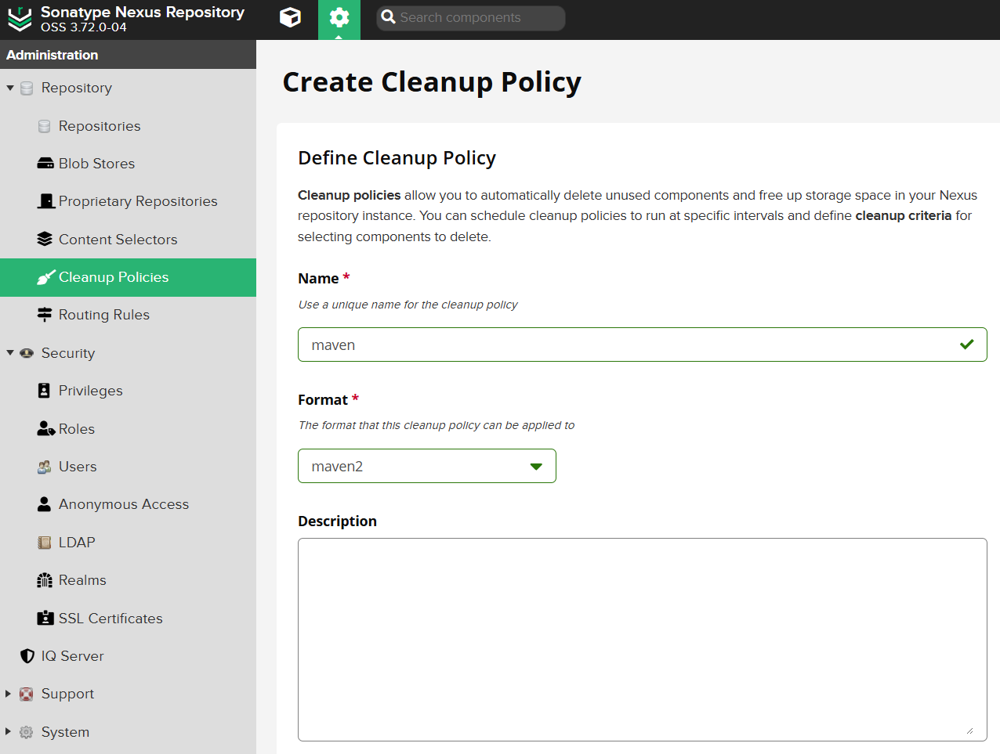
    </p>
5. Choose the **Criteria** for cleaning.
    <p align="center">
      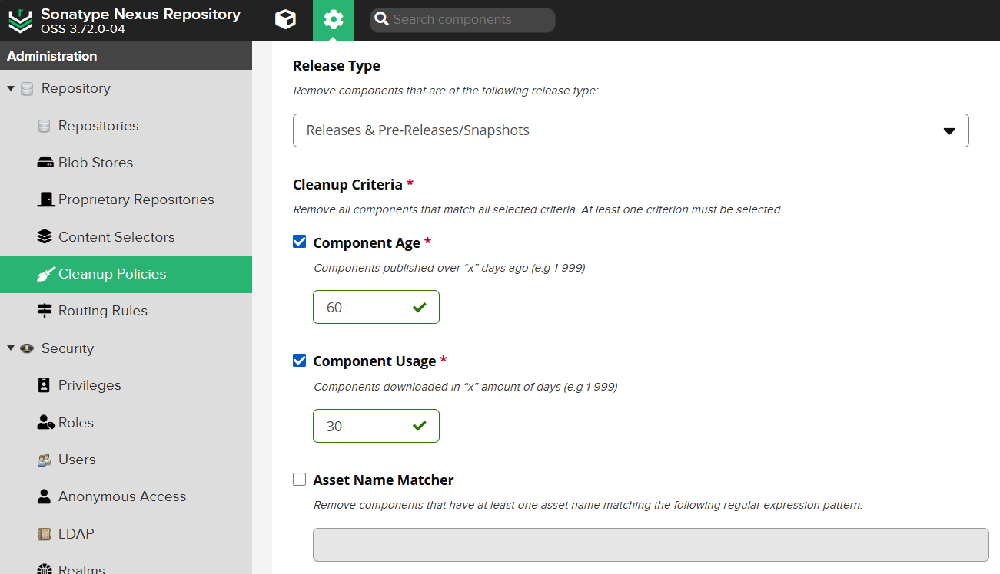
    </p>
6. Click **Save**.

### 2. Assign the Policy to a Repository

Creating the policy is only the first step. You must link it to one or more repositories for it to take effect.

1. Go to **Settings > Repository > Repositories**.
2. Select the repository.
3. Scroll down to the **Cleanup** section.
4. **Cleanup Policies:** Apply the created policy.
5. Click **Save**.
    <p align="center">
      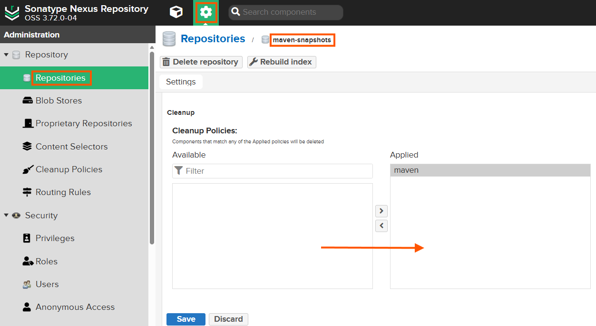
    </p>

> **Soft Delete:** When a cleanup policy runs, it performs a "soft delete". The components disappear from the UI and are marked for deletion, but the physical files still remain in the **Blob Store** (see **Step 7**) until a "Compact" task is run.

### 3. Scheduled Tasks and Compacting Storage

Nexus uses **Tasks** to run background operations like database backups or cleanup. When you create a Cleanup Policy, Nexus automatically creates a task named `Cleanup service`. However, to actually free up disk space, you need a **Compact blob store** task.

**How to create a Compact Task:**

1. Go to **Settings > System > Tasks**.
2. Click **Create task**.
    <p align="center">
      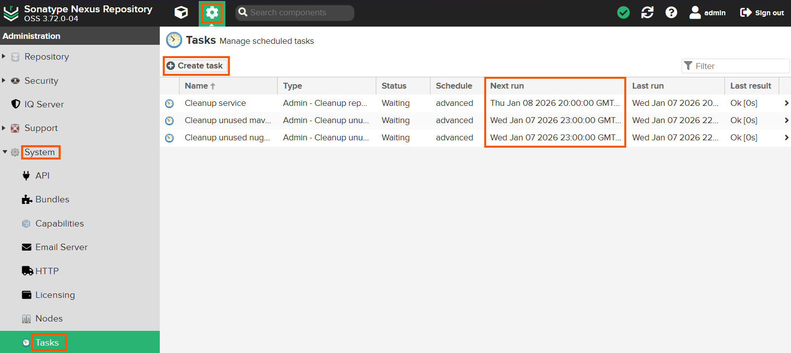
    </p>
3. **Task Type:** Select `Admin - Compact blob store`.
4. **Name:** A name for your task.
5. **Blob store:** Select your store (e.g., `default` or the one created in **Step 7**).
6. **Schedule:** Set the task frequency. (e.g., Weekly, every Sunday at 02:00 AM).
7. Click **Create task**.
    <p align="center">
      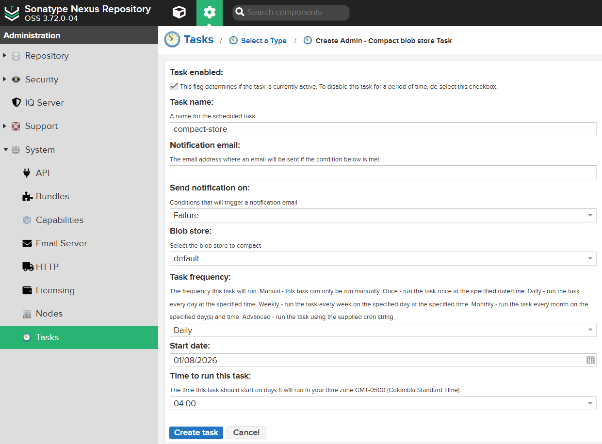
    </p>

### 4. Executing a Task Manually

If your disk is almost full and you cannot wait for the scheduled time:

1. Navigate to **Settings > System > Tasks**.
2. Select your task from the list.
3. Click the **Run** button at the top of the screen.
    <p align="center">
      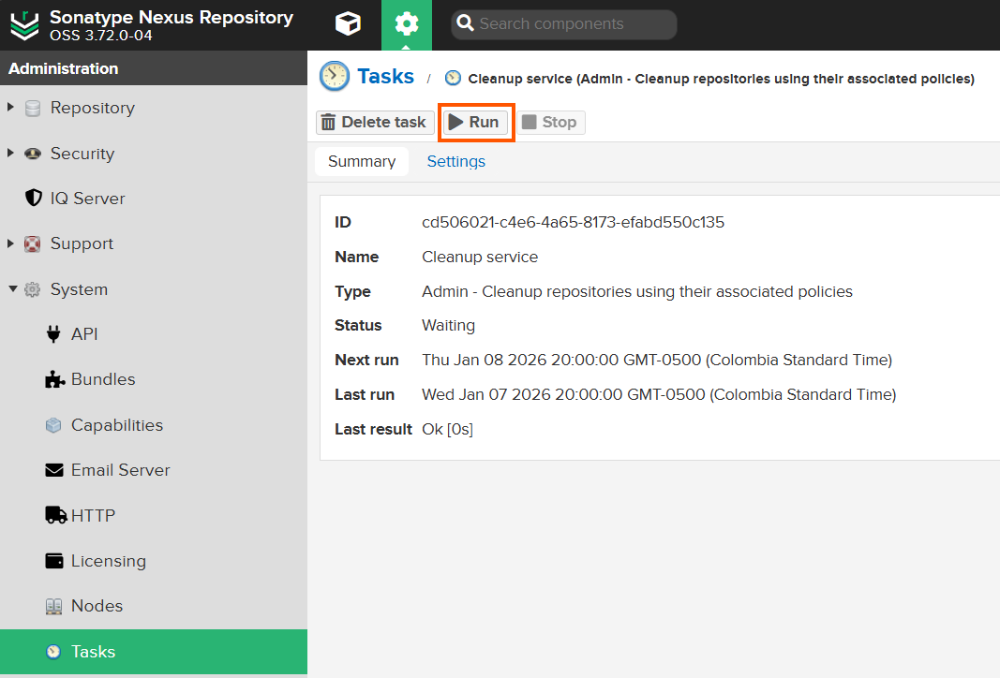
    </p>

</details>

---

<details>
<summary><strong>Step 9: Working with the Nexus REST API</strong></summary>

As you move towards automation and CI/CD, you won't always want to use the web interface. Nexus provides a powerful **REST API** that allows you to interact with the repository programmatically.

### Access Control and Roles

Everything you can do via the API is governed by the same **Role-Based Access Control (RBAC)** we set up in **Step 5**.

* If your user only has `read` permissions, an API call to delete a repository will return a `403 Forbidden` error.
* To use the API, you must provide your credentials via **Basic Authentication** (e.g., `curl -u username:password`).

### Some Examples

1. **List all Repositories:**

    Useful for verifying the server is up and seeing what endpoints are available.

    ```bash
    curl -u developer:your_password -X GET "http://{nexus_ip}:8081/service/rest/v1/repositories"
    ```

2. **Search for a Component:**

    Search for your uploaded artifact by its Group ID or Name.

    ```bash
    curl -u developer:your_password -X GET "http://{nexus_ip}:8081/service/rest/v1/search?repository=maven-snapshots&maven.groupId=com.example"
    ```

3. **Download the Latest Version of an Artifact:**

    One of the most powerful features of the API is the ability to fetch the "latest" version without knowing the exact version number or timestamp. This is perfect for automation scripts that always need the most recent build.

    ```bash
    curl -u developer:your_password -L -X GET \
    "http://{nexus_ip}:8081/service/rest/v1/search/assets/download?sort=version&repository=maven-snapshots&maven.groupId=com.example&maven.artifactId=my-app&maven.extension=jar" \
    --output my-app-latest.jar
    ```

> Always consult the **API documentation page directly on your server** for the most accurate endpoints:
> Navigate to: `http://{nexus_ip}:8081/#admin/system/api` (requires admin login).

</details>
